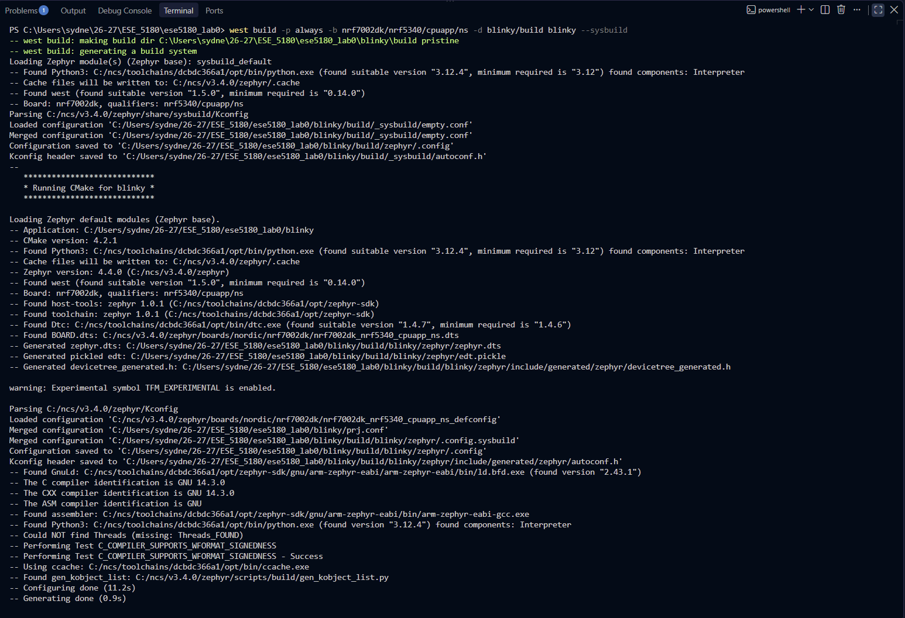
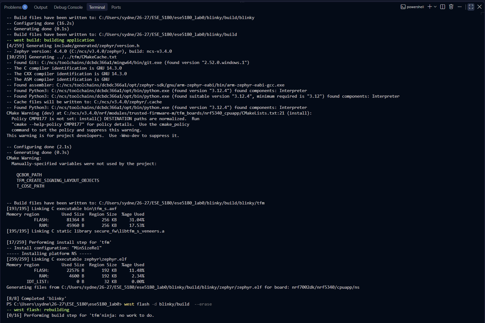
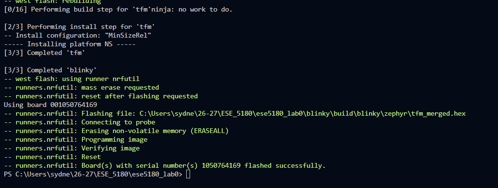
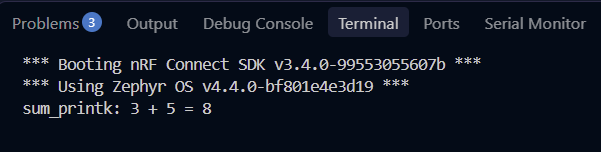
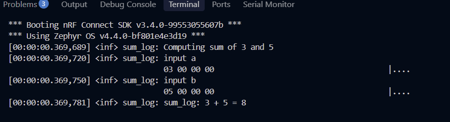

# ESE5180: Lab 0 Zephyr

| Team Member Name  | Email Address                 |
| ----------------- | ----------------------------- |
| Sydney Fitzgerald | sydfitz@engineering.upenn.edu |

**GitHub Repository URL:** https://github.com/sydfitz/ese5180_lab0

### 1. Hello (Vanilla) Zephyr

(1.1) Done; video uploaded to Google form

### 2. Hello (Nordic) Zephyr

(2.1) Done; Zephyr application committed under blinky/.

(2.2) Done; video uploaded to Google Form

### 3. Building with West

(3.1) Terminal output:

### 5. Device Tree (DT)

(5.1) Done; new alias defined in blinky\boards\nrf7002dk_nrf5340_cpuapp_ns.overlay, used in blinky\src\main.c. 

(5.2) Done; button is polled every 50ms in the main loop in blinky_revised\src\main.c, toggles the led5180 on each new button press.

(5.3) Done; new button alias button5180 defined in blinky_revised\boards\nrf7002dk_nrf5340_cpuapp_ns.overlay and blinky_revised\boards\nrf7002dk_nrf5340_cpuapp.overlay, used in blinky_revised\src\main.c.

### 6. Printing vs. Logging

(6.1) CONFIG_SUM_PRINT = y:

CONFIG_SUM_LOG = y:

(6.2) TODO: Make a short video showing hexdump, log, and printk. Name the video file: f26_lab0_6.2_pennkey

(6.3) Done; the updated code for this part is in a new application folder named /printing_logging.

### 7. Ztest for Unit Testing

(7.1) Implement the test case in "TO DO" to test your function. Commit your updated Zephyr application to your GitHub repository

(7.2) Take screenshots of the testing outputs (laptop) in the terminal.

### 8. Adding a Peripheral (BME280)

(8.1) Print out the temperature. Take screenshots of your logging output. Commit your Zephyr application to your GitHub repository.

(8.2) Create a Ztest to test if the device tree is set up and run sanity checks. Take and embed screenshots of your Ztest output for your README.md. Commit your Zephyr application to your GitHub repository.

### 9. Teaching Team Checkoff

(9.1) Demonstrate and explain implementation details from the assignment: Sections 7. Ztest for Unit Testing and 8. Adding a Peripheral (BME280).

(9.2) Answer questions, without assistance, about the technology leveraged in this assignment and within the lectures:
