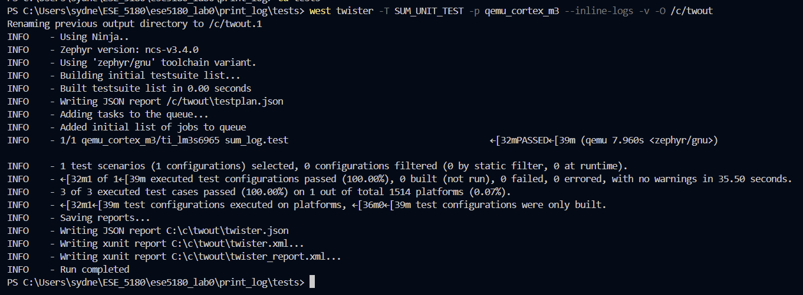
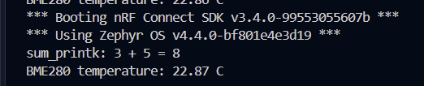
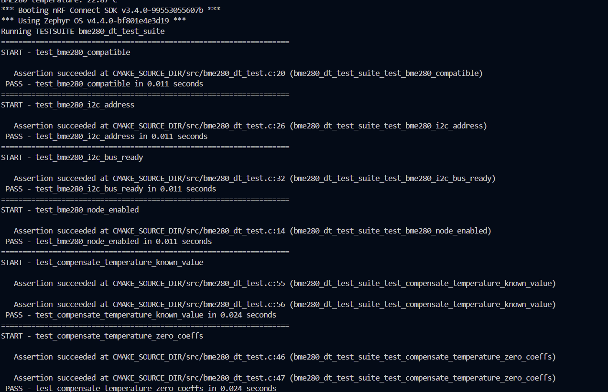
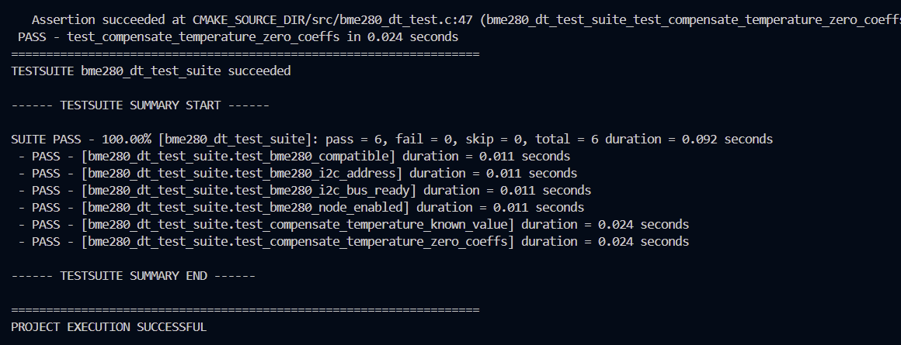

# ESE5180: Lab 0 Zephyr

| Team Member Name  | Email Address                 |
| ----------------- | ----------------------------- |
| Sydney Fitzgerald | sydfitz@engineering.upenn.edu |

**GitHub Repository URL:** https://github.com/sydfitz/ese5180_lab0

### 1. Hello (Vanilla) Zephyr

(1.1) Done; video uploaded to Google form

### 2. Hello (Nordic) Zephyr

(2.1) Done; Zephyr application committed under blinky_revised/.

(2.2) Done; video uploaded to Google Form

### 3. Building with West

(3.1) Terminal output:

### 5. Device Tree (DT)

(5.1) Done; new alias defined in blinky_revised\boards\nrf7002dk_nrf5340_cpuapp_ns.overlay, used in blinky_revised\src\main.c. 

(5.2) Done; button is polled every 50ms in the main loop in blinky_revised\src\main.c, toggles the led5180 on each new button press.

(5.3) Done; new button alias button5180 defined in blinky_revised\boards\nrf7002dk_nrf5340_cpuapp_ns.overlay and blinky_revised\boards\nrf7002dk_nrf5340_cpuapp.overlay, used in blinky_revised\src\main.c.

### 6. Printing vs. Logging

(6.1) CONFIG_SUM_PRINT = y:

CONFIG_SUM_LOG = y:

(6.2) Done; video upload to google form

(6.3) Done; the updated code for this part is in a new application folder named /print_log.

### 7. Ztest for Unit Testing

(7.1) Done; relevant Ztest code is under print_log/tests/SUM_UNIT_TEST

(7.2) Screenshot of testing outputs (running on qemu, I had to redirect the output path to C:\twout due to Windows path too long errors):

### 8. Adding a Peripheral (BME280)

(8.1) Done; temp printing code is under print_log/bme280_temp/. CONFIG_TEMP_READ is a separate Kconfig option from the CONFIG_SUM_PRINT / CONFIG_SUM_LOG choice.

(8.2) Done; Ztest code is under print_log/tests/BME280_DT_TEST, testing that the BME280 devicetree node/I2C bus are set up correctly and sanity-checking sensor. I had the same file path length issue, so I built to a shorter output location than the default.

